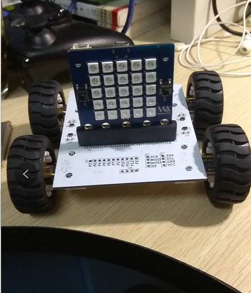

# Micropython-BIT-CAR

     
MicroPython drivers for bit-car

## 模块介绍

使用的主控板子: [BPI:BIT](https://github.com/aJantes/introduce-bpi-bit/blob/master/README.md)

使用的小车扩展板: [BPI-CAR_CAR-FWD](https://github.com/yelvlab/BPI-CAR_CAR-FWD)


## PCA9685驱动库

默认I2C地址0x40
PCA9685是一块I2C扩展16路PWM信号的芯片,我们直接使用Adafruit家的开源库即可。关于pca9685库的使用我们这里不在赘述，查看adafruit的文档即可。
 [micropython-adafruit-pca9685](https://github.com/adafruit/micropython-adafruit-pca9685)

## CAR的主要函数

函数/成员|功能
:--|:--
forward(speed)|前进，speed为pwm的占空比，范围是0-4095
backward(speed)|后退，speed的作用同上
turn_left(speed)|原地左转，speed的作用同上
turn_right(speed)|原地右转，speed的作用同上
stop()|停止
DataCache|控制数据的接收缓冲区，是一个队列
control()|这个函数需要放在线程中运行，通过DataCache.append()向control发送小车的运行指令N(前进)S(后退) W(左转) E(右转)

## 示例代码

```python

from machine import Pin, I2C
    i2c = I2C(scl=Pin(22), sda=Pin(21), freq=10000)
    car = bpicar(i2c)
    import utime
    import _thread
    _thread.start_new_thread(car.control,())

    car.forward(4095)
    utime.sleep(2)
    car.backward(4095)
    utime.sleep(2)
    car.turn_left(4095)
    utime.sleep(2)
    car.turn_right(4095)
    utime.sleep(2)
    car.stop()

    car.DataCache.append('W')
    car.DataCache.append('W')
    car.DataCache.append('W')
    car.DataCache.append('W')
    utime.sleep(10)
    car.DataCache.append('A')
    car.DataCache.append('A')
    utime.sleep(10)
    car.DataCache.append('S')
    car.DataCache.append('S')
    car.DataCache.append('S')
    car.DataCache.append('S')
    car.DataCache.append('S')
    car.DataCache.append('S')
    car.DataCache.append('S')
    car.DataCache.append('S')
    utime.sleep(10)
    car.stop()

```
